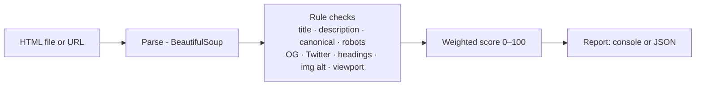

# seo-meta-analyzer

> Audit a web page's on-page SEO signals — meta tags, Open Graph, headings, and image alt coverage — and get a scored, actionable report.


## Overview

`seo-meta-analyzer` parses an HTML page and checks the on-page signals that search engines and previews rely on, then returns a 0–100 score with prioritized recommendations. It runs against a **local file** or a **URL**, so you can wire it into CI on a build's static output or point it at a live page.

## Architecture



## Features

- Title and meta-description presence **and length** checks
- Canonical link and `meta robots` validation
- Open Graph and Twitter Card coverage
- Exactly-one-`<h1>` and heading-hierarchy checks
- Image `alt`-text coverage
- Weighted 0–100 score with severity-ranked recommendations
- Console **or** JSON output; optional FastAPI `POST /audit` endpoint
- Runs offline against local HTML — no network required

## Tech stack

Python 3.11 · BeautifulSoup4 · Click · FastAPI (optional)

## Getting started

```bash
pip install -e .
# audit a bundled fixture
seo-meta-analyzer --file fixtures/good.html
# audit a live URL
seo-meta-analyzer --url https://example.com
# machine-readable output
seo-meta-analyzer --file fixtures/mixed.html --json
```

Run the optional API:

```bash
pip install -e . uvicorn
uvicorn seometa.api:app --reload   # POST /audit  {"html": "..."}
```

## Usage

The bundled fixtures demonstrate the range: `fixtures/good.html` (clean), `fixtures/mixed.html` (some issues), and `fixtures/poor.html` (many issues). Each run prints per-check findings (pass / warn / fail), the aggregate score, and the top fixes to make first.

## Project structure

```
seometa/
  analyzer.py   # orchestration → structured findings
  rules.py      # individual checks + weights
  report.py     # console + JSON rendering
  cli.py        # Click entrypoint
  api.py        # optional FastAPI app
fixtures/       # good / mixed / poor sample pages
tests/          # pytest over the fixtures (offline)
```

## Testing

```bash
pip install -e . pytest
pytest
```

## Roadmap

- Batch mode over a sitemap or a directory of pages
- Pluggable rule weights via a config file
- HTML report export

## License

MIT © 2026 Matthews Wong

---

_Part of my cloud & AI portfolio — see [github.com/matthews-wong](https://github.com/matthews-wong)._
